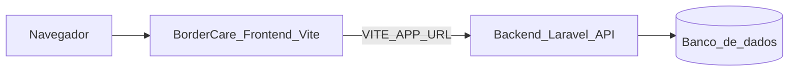

# BorderCare

Frontend do **BorderCare**, sistema web de gestão para abrigos de animais, desenvolvido como projeto de extensão. A aplicação oferece autenticação de usuários e integração com uma API REST (Laravel) para operações do dia a dia do abrigo.

## Funcionalidades

- **Painel** — visão geral do abrigo e busca rápida
- **Fichas** — cadastro e acompanhamento de animais
- **Lembretes** — agenda de lembretes e alertas
- **Adoções** — registro de adoções e geração de contratos em PDF
- **Gastos** — controle financeiro do abrigo
- **Relatórios** — gráficos e exportação em PDF
- **Adotantes** — cadastro de adotantes

## Tecnologias

- React 19 + TypeScript
- Vite 8
- Tailwind CSS 4
- React Router
- Axios
- Recharts

## Arquitetura



Este repositório contém apenas o **frontend**. O backend (API Laravel) está em um **repositório separado**; consulte o README do backend para instruções de instalação e execução.

Documentação complementar do contrato da API de relatórios: [docs/RELATORIOS_API.md](docs/RELATORIOS_API.md).

## Pré-requisitos

| Item | Detalhe |
|------|---------|
| Node.js | Versão LTS recente (recomendado 20 ou superior) |
| npm | Incluso com o Node.js |
| Backend | API Laravel em repositório separado, rodando e acessível pela URL configurada em `VITE_APP_URL` |

## Configuração do ambiente

1. Clone este repositório:

```bash
git clone <url-do-repositorio>
cd ProjetoExtencaoFront
```

2. Instale as dependências:

```bash
npm install
```

3. Crie o arquivo de variáveis de ambiente na raiz do projeto:

```bash
cp .env.example .env
```

4. Edite o `.env` e configure a URL base do backend (sem barra no final):

```env
VITE_APP_URL=http://127.0.0.1:8000
```

A URL deve apontar para o servidor da API Laravel (por exemplo, `php artisan serve` na porta 8000).

5. Suba o backend conforme as instruções do repositório da API antes de usar o frontend.

## Como rodar localmente

Com o backend em execução e o `.env` configurado:

```bash
npm run dev
```

Acesse [http://localhost:5173](http://localhost:5173) e faça login com um usuário válido da API.

### Scripts disponíveis

| Comando | Descrição |
|---------|-----------|
| `npm run dev` | Servidor de desenvolvimento (Vite, porta padrão 5173) |
| `npm run build` | Build de produção (`tsc` + `vite build`) |
| `npm run preview` | Preview local do build de produção |
| `npm run lint` | Verificação de código com ESLint |

## Deploy

Este frontend é uma SPA estática gerada pelo Vite. Passos básicos:

1. Defina `VITE_APP_URL` com a URL de **produção** da API antes do build (variáveis `VITE_*` são embutidas em tempo de build).
2. Execute o build:

```bash
npm run build
```

3. Publique o conteúdo da pasta `dist/` em um serviço de hospedagem estática (Nginx, Apache, Netlify, Vercel, GitHub Pages, etc.).
4. Configure o servidor para redirecionar rotas desconhecidas para `index.html` (necessário para o React Router em rotas como `/painel`, `/fichas`, etc.).

O backend deve estar deployado separadamente e acessível pela URL configurada em `VITE_APP_URL`.

## Licença

Este projeto não possui licença pública definida. Trata-se de um projeto acadêmico de extensão.

## Equipe

- Luiz Henrique Ribas Edling
- Danton Bernardo Oliveira de Souza
- Felipe Gorgo Kiçula
- Rubens Santana
